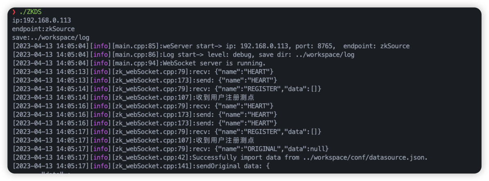
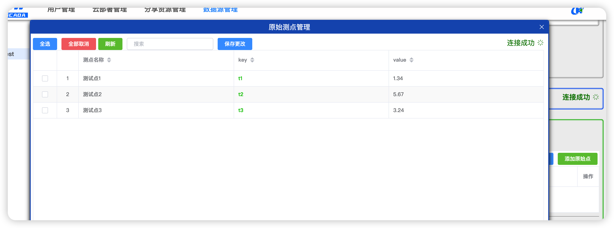

<!--
 * @description: 
 * @version: 
 * @Author: zwy
 * @Date: 2023-04-13 13:47:14
 * @LastEditors: zwy
 * @LastEditTime: 2023-04-13 14:24:28
-->
# zkview c++ data source

## 1、[Simple-WebSocket-Server](https://gitlab.com/eidheim/Simple-WebSocket-Server)

一个非常简单、快速、多线程、独立于平台的Web Socket（WS）和Web Socket Secure（WSS）服务器和客户端库，使用C++11、Asio（可以使用Boost.Asio和独立的Asio）和Open SSL实现。创建它是在C++中创建Web套接字端点的一种简单方法。

## 2、[JsonCPP](https://github.com/open-source-parsers/jsoncpp)

JSON是一种轻量级的数据交换格式。它可以表示数字、字符串、值的有序序列以及名称/值对的集合。Json Cpp是一个C++库，它允许操作Json值，包括对字符串的序列化和反序列化。它还可以在非序列化/序列化步骤中保留现有注释，使其成为存储用户输入文件的方便格式。

## 3、Ours

该项目使用Simple-WebSocket-Server和JsonCPP设计了一套用于zkview平台上上传数据源的SDK。

- 编译源码：
    ```shell
    cd ${our_project_dir}
    mkdir build && cd build

    cmake ..
    make
    ```
- 更改配置文件：位于 `${our_project_dir}/workspace/conf/system.json`
    ```json
    {
        "ip": "192.168.0.113",
        "port": 8765,
        "endpoint": "zkSource",
        "logLevel": 4,
        "logSaveDir": "../workspace/log"
    }
    ```
    ip: 主机IP

    port: websocket server 端口。windows上请关闭防火墙，linux上请开放相应端口

    endpoint: 路由地址

    logLevel: log日志等级

       5 -> Debug    
       4 -> Verbose  
       3 -> Info     
       2 -> Warning  
       1 -> Error    
       0 -> Fatal    
    logSaveDir: 保存日志文件的路径

    **重要提示：** 相对路径是像对于`bin/ZKDS`可执行文件而言

- 发送的数据来自`${our_project_dir}/workspace/conf/datasource.json`
    data: 原始数据
    nameMap: data中每个数据数据的名字

    **因此：  data和nameMap必须长度一致**

    ```json
    {
        "data": {
            "t1": 1.34,
            "t2": 5.67,
            "t3": 3.24
        },
        "nameMap": {
            "t1": "测试点1",
            "t2": "测试点2",
            "t3": "测试点3"
        }
    }
    ```

-  开启运行
    
    
    
        